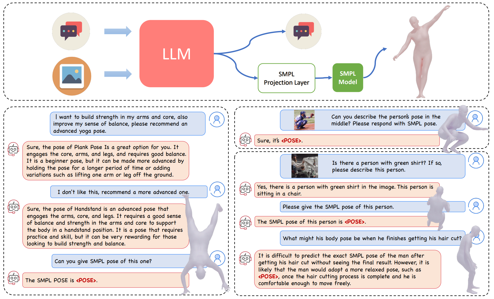

<!-- PROJECT LOGO -->

<p align="center">
  <h1 align="center">ChatPose: Chatting about 3D Human Pose
 </h1>
<!--  <p align="center">
    <a href="https://ps.is.tuebingen.mpg.de/person/yxiu"><strong>Yao Feng</strong></a>
    ·
    <a href="https://ps.is.tuebingen.mpg.de/person/jyang"><strong>Jinlong Yang</strong></a>
    ·
    <a href="https://ps.is.tuebingen.mpg.de/person/black"><strong>Michael J. Black</strong></a>
    .
    <a href="https://people.inf.ethz.ch/pomarc/"><strong>Marc Pollefeys</strong></a>
    .
    <a href="https://ps.is.mpg.de/person/tbolkart"><strong>Timo Bolkart</strong></a>
  </p>
  <h2 align="center">SIGGRAPH Asia 2022 conference </h2>
  -->
  <div align="center">
    
  </div>
</p> 

<!-- We introduce PoseGPT, a multi-model LLM designed for chatting about human pose that produces 3D human poses (SMPL pose parameters) upon user request. 
PoseGPT features a specialized SMPL projection layer trained to convert language embeddings into 3D human pose parameters. Our demonstration includes conversations both without (left) and with (right) an image input.  
Upon detection of a pose token, the token is used to estimate the SMPL pose parameters and subsequently generate the corresponding 3D body mesh. -->
This is the implementation of ChatPose (formerly known as PoseGPT). More details please check our [Project](https://yfeng95.github.io/ChatPose) page.  

<!-- PROJECT LOGO -->
ChatPose is a Multi-modal LLM to understand and reason about 3D Human poses (as SMPL pose format). ChatPose enables users to ask questions regarding human poses and infer these poses from both images and text descriptions.

## Getting Started
Clone the repo:
  ```bash
  git clone https://github.com/yfeng95/PoseGPT
  cd PoseGPT
  ```  
### Requirements
```bash
bash install_conda.sh
``` 
### Download data 
```
bash fetch_data.sh
```
This step will download SMPL-X model for visualization. 

## Inference
* chatting: 
```
python main_chat.py 
```
* chatting with image input:
```
python main_chat.py --image_file dataset/baber.png
```
<!-- * test:
```
bash scripts/main_inference.py
``` -->
<!-- ## Training 
TBD -->

## Citation
```bibtex
@InProceedings{feng2024chatpose,
    author = {Feng, Yao and Lin, Jing and Dwivedi, Sai Kumar and Sun, Yu and Patel, Priyanka and Black, Michael J.},
    title = {{ChatPose}: Chatting about 3D Human Pose},
    booktitle = {CVPR},
    year = {2024}
}  
```
## Acknowledgments 
This repository is built extensively on top of [LLaVA](https://github.com/haotian-liu/LLaVA) and [LISA](https://github.com/dvlab-research/LISA). 
Some other great resources we benefit from:   
[TokenHMR](https://github.com/saidwivedi/TokenHMR), [PoseScript](https://github.com/naver/posescript) and [4D-Humans](https://github.com/shubham-goel/4D-Humans) for 3D human pose. 

